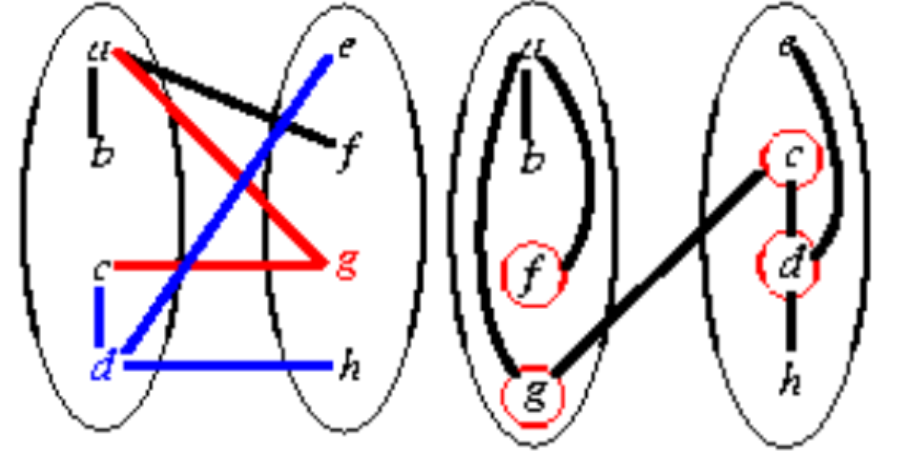

# Parallel VLSI Partition Algorithms Based on Message Passing Model

## Group Member

* James Wu (jhensyuw) 
* Yueqi Song (yueqis)

## Updates

* [Link to Project](https://github.com/yueqis/Parallel-VLSI-Partition)
* [Link to Proposal](https://github.com/yueqis/Parallel-VLSI-Partition/blob/main/proposal.pdf)

### Schedule

* [x] Week 0 (3/18 - 3/24) Brainstorm ideas
* [x] Week 1 (3/25 - 3/27) Verify our ideas with the professors, and finish drafting the proposal
* [ ] Week 1 Cont. (3/28 - 3/31) Draft the starer code for the sequential version and test this baseline performance on CPU
* [ ] Week 2 (4/1 - 4/7) Implement basic MPI parallel algorithm based on Simulated Annealing; research on other potential solutions; 
* [ ] Week 3 (4/8 - 4/14) Implement another MPI parallel algorithm based on research and other algorithms discussed in this proposal; finish the milestone report
* [ ] Week 4 (4/15 - 4/21) Integrate CUDA acceleration with MPI solutions
* [ ] Week 5 (4/22 - 4/28) Attempt to solve a more difficult problem formulation and implement different CUDA codes for different algorithms
* [ ] Week 6 (4/29 - 5/4) Compare results from different algorithms and different CUDA accelerations; prepare for demo graphs; draft the final report

## Project Summary

We are going to explore various versions of parallel algorithms with MPI to assess solution performance, load balancing, speedup, and communication costs. Additionally, CUDA/GPU integration is investigated to observe potential speedup enhancements in the solutions.

## Background 

The problem we are solving is VLSI partitioning. VLSI partitioning [3] is an important step to design more complicated integrated circuits (ICs), which divides a circuit into multiple smaller modules. This approach allows the optimization process to be more manageable. For instance, after partitioning the whole circuit, we can optimize individual modules to enhance the overall chip performance given some given design requirements. Current research have proposed many  techniques to reach optimal solutions to partitioning based on different cost metrics, including  wire length minimization, load balancing, or power consumption minimization.

    </a>  
    Figure 1: example VLSI partitioning

To further demonstrate VLSI partitioning, we can model it as a graph problem. In a graph G(V, E) with potentially uniform weights on vertices and edges, along with a parameter p, the goal is to discover divide G's vertices into p partitions. The objective is to achieve equitable sums of vertex weights within each partition while minimizing the total weight of edges crossing between partitions. Consider the example of Figure 1 [1]. If there are 8 vertices with unit weights on each edge, and the objective is to create 2 partitions, the optimal solution prioritizes the one on the right. In this solution, there's only 1 edge crossing the partition, whereas the alternative on the left entails 5 edge crossings.

VLSI partitioning can benefit from parallelism in the following aspects. Firstly, as we perform the partitioning, the solution space can be extremely large to find the optimal solution, which grows exponentially according to the problem size. If we adopt parallelism to explore different regions of the solution space at the same time, then we are more likely to find solutions with high quality in a reasonable period of time. Secondly, traditional sequential partitioning methods  may have trouble solving designs at a very large scale, especially when current IC designs have become increasingly more complicated. Thus, parallelism boosts scalability as the whole circuit is decomposed and distributed over multiple processors, which makes analysis of larger design possible. Thirdly, partitioning algorithms may include computationally intensive tasks to perform cost metrics calculation and optimization. Parallelism can speed up these tasks by taking advantage of multiple cores, reducing overall runtime and enhancing efficiency.

## The Challenge

### Workload

First, we need to note that this problem is a challenging NP-hard and NP-complete problem. In other words, there are exponentially-many number of solution candidate to the task ($m^n$-many solutions if $m$ is the number of partitions and $n$ is the number of vertices); nevertheless, given a potential solution candidate, we can verify in polynomial time whether the solution is indeed the correct solution to the task.

Given this, the most naive way to solve this problem might be using a brute-force algorithm, first obtaining all possible solution candidates, then searching through all solution candidates and verifying whether the candidate is the correct solution, and finally adopting the best candidate as the final solution. To implement this algorithm, we can first find all solution candidates easily by going through all possible ways of putting each vertex into the partitions. Then, we can randomly assign equal number of solution candidates to each thread, such that workload is maximally balanced. There will be no dependencies and no divergent execution. However, using this method, cache locality would not be very good, as memory access will be random, and every thread will need to access all vertices at a random order to verify whether a solution candidate is correct and is the best. What might potentially make this difficult to parallel is that there might be high communication cost, as for every solution candidate assigned to it, each thread will need to communicate with other threads to check whether its solution is the best solution (i.e., min-cost solution), so its at least $O(m^n)$-many times of communication, thus this algorithm will have high communication to computation ratio. Therefore, this way of implementing the algorithm will be not as complex to implement and can enable us to get the minimal cost solution, while having balanced workload, but not very good cache locality. In our future explorations, we might want to explore ways to improve cache locality, and further learn about how to maximally exploit cache locality in practice.

Another potential algorithm is that we can first randomly assign vertices into partitions, and then iterate through each vertex, trying to see whether putting that vertex in a different partition will help improving cost; if moving the vertex improve the cost, then move it, otherwise keep it as is. This solution is a greedy solution, but may lead to less optimal cost as compared to the previous one. One potential way to assign workload is assigning a batch of vertices to move to each thread, and each thread will be finding the best partition to put each vertex in its batch. Using this algorithm, workload may be balanced, as we would assign equivalent number of vertices to each batch. There should be no dependencies and no divergent execution. This algorithm still has not very good locality, as we still need to iterate through all vertices to find the best partition to put each vertex. However, communication cost would be lower, as for this greedy algorithm, we at most need to communicate each time a thread finished working on a vertex, which will be at most $O(n)$-many times of communication, much less than $O(m^n)$ as in the previous solution. Further, if we reduce to communicate only after a thread finishes a batch, communication will be further reduced to $O(n/k)$ where $k$ is batch size (in exchange of potentially higher cost), so this will have low communication to computation ratio. What might potentially make this difficult to implement is that this algorithm might lead to higher target cost as this is a greedy algorithm, so we will need to optimize this. From this algorithm, we will learn how to balance out optimizing the target cost v.s. optimizing computation time.

### Constraints

For a large partitioning problem with many vertices and many circuits, it would be very difficult for a CPU/GPU cache to load all vertices and circuits, which will lead to higher cache misses and less cache locality. In addition, we would want to create multiple copies of the partitions, so that each thread can change its own partitions without affecting the work of other threads.

## Resources

We would use the PSC machines to measure CPU and GPU performance. We will write our own starter code from scratch. We will use as reference some paper on what is VLSI [3] and potential algorithm to solve VLSI [2]. Potentially, we will explore GPUs other than the ones provided access on PSC. For example, we have access to V100, A100, A6000, and 6000Ada, etc.

## Goals and Deliverables

### Plan to Achieve

* Implement a basic MPI parallel partitioning algorithm based on Simulated Annealing
* Implement 1 or 2 other MPI parallel partitioning algorithms based on other research
* Integrate GPU CUDA acceleration with the MPI solutions based on other research

### Hope to Achieve
* Solve a more difficult problem formulation, such as hyper-edges and non-unit weight costs
* Implement different CUDA codes and compare their combinations with different MPI parallel algorithms

### Demo Plan
* Graphs showing the comparison of the solution performance and speedup between different MPI parallel algorithms
* Graphs showing the speedup after the integration with GPU CUDA
* Experimental results given different problem sizes

### Platform Choice
We'll develop the parallel algorithms using C++ and MPI, potentially incorporating Python for benchmark scripting. Experiments will be conducted on GHC for debugging and performance assessment on PSC machines, which scales from 1 to 256 cores, allowing for a comprehensive exploration of algorithm performance on larger systems. We choose this platform because we have already performed several experiments in Assignment 3 and Assignment 4.

[1] Yao-Wen Chang. *PHYSICAL DESIGN FOR NANOMETER ICS Course*. 2021. url: https://nol.ntu.edu.tw/nol/coursesearch/print_table.php?course_id=943%20U0280&class=&dpt_code=9210&ser_no=16181&semester=95-2.

[2] J R Gilbert and E Zmijewski. "Parallel graph partitioning algorithm for a message-passing multiprocessor". In: Int. J. Parallel Program.; (United States) (1987).

[3] *Partitioning of VLSI circuits and systems*. 1996, pp. 83-87. doi: 10.1109/DAC.1996.545551.
